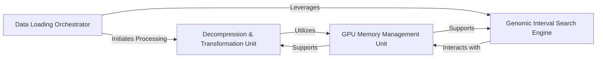

## Details

Analysis of the Core Data Processing Engine within the bigwig-loader library, detailing its fundamental components and their interdependencies for high-performance genomic data manipulation.

### Decompression & Transformation Unit

This unit is responsible for the efficient decompression of raw, compressed data blocks fetched from BigWig files and their initial transformation into a usable format. It handles the conversion of interval-based genomic data into dense value arrays, a critical step for preparing data for machine learning models. Its performance directly impacts the overall data loading speed.

**Related Classes/Methods**:

- <a href="https://github.com/pfizer-opensource/bigwig-loader/blob/main/bigwig_loader/decompressor.py#L1-L1" target="_blank" rel="noopener noreferrer">`bigwig_loader.decompressor` (1:1)</a>

- <a href="https://github.com/pfizer-opensource/bigwig-loader/blob/main/bigwig_loader/intervals_to_values.py#L22-L150" target="_blank" rel="noopener noreferrer">`bigwig_loader.intervals_to_values` (22:150)</a>

### GPU Memory Management Unit

This component is vital for optimizing memory usage and data transfer, especially for GPU-accelerated operations. It manages the allocation, deallocation, and asynchronous transfer of data to and from the GPU, ensuring that data is available efficiently for CuPy-based computations. It acts as a central memory pool for GPU operations.

**Related Classes/Methods**:

- <a href="https://github.com/pfizer-opensource/bigwig-loader/blob/main/bigwig_loader/memory_bank.py#L1-L1" target="_blank" rel="noopener noreferrer">`bigwig_loader.memory_bank` (1:1)</a>

- <a href="https://github.com/pfizer-opensource/bigwig-loader/blob/main/bigwig_loader/cupy_functions.py#L1-L1" target="_blank" rel="noopener noreferrer">`bigwig_loader.cupy_functions` (1:1)</a>

### Genomic Interval Search Engine

This unit provides highly optimized algorithms for performing search operations on genomic intervals. It includes functionalities like searchsorted for efficient interval queries, and methods for merging and subtracting intervals. These operations are crucial for accurately mapping genomic coordinates to data points and manipulating genomic regions.

**Related Classes/Methods**:

- <a href="https://github.com/pfizer-opensource/bigwig-loader/blob/main/bigwig_loader/searchsorted.py#L43-L83" target="_blank" rel="noopener noreferrer">`bigwig_loader.searchsorted` (43:83)</a>

### Data Loading Orchestrator

This component provides high-level functional interfaces that coordinate the entire data loading and initial processing pipeline. It orchestrates calls to the Decompression & Transformation Unit and the Genomic Interval Search Engine, streamlining the process of loading, decoding, and performing initial searches on genomic data. It acts as an abstraction layer for complex data retrieval workflows.

**Related Classes/Methods**:

- <a href="https://github.com/pfizer-opensource/bigwig-loader/blob/main/bigwig_loader/functional.py#L1-L1" target="_blank" rel="noopener noreferrer">`bigwig_loader.functional` (1:1)</a>

### [FAQ](https://github.com/CodeBoarding/GeneratedOnBoardings/tree/main?tab=readme-ov-file#faq)