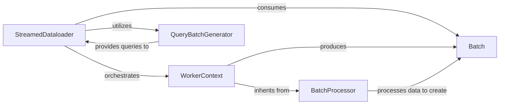

## Details

The `Data Loading Pipeline Orchestrator` subsystem is the core engine for efficiently loading, processing, and batching genomic data for deep learning applications. It embodies the project's emphasis on high-performance data loading, GPU acceleration, and modular design.

### StreamedDataloader

The central orchestration engine and user-facing entry point for the data loading pipeline. It manages the lifecycle of `WorkerContext` instances, coordinates the generation of queries via `QueryBatchGenerator`, and collects processed `Batch` objects, ensuring efficient and parallel data streaming. Its inheritance from `BigWigCollection` implies direct management of underlying BigWig data sources.

**Related Classes/Methods**:

- `StreamedDataloader`

### WorkerContext

An independent worker unit within the `StreamedDataloader`'s multi-process/multi-threaded architecture. It inherits from both `BatchProcessor` and `BigWigCollection`, enabling it to perform core data processing (transformations, decoding) and directly access BigWig data. Its primary responsibility is to fetch raw data based on queries, apply transformations, and produce standardized `Batch` objects.

**Related Classes/Methods**:

- `WorkerContext`

### BatchProcessor

Defines the reusable, low-level logic for processing a single batch of raw data into a standardized format. It integrates components like `Decoder` for data decompression and `MemoryBank` for efficient memory management (likely GPU-optimized). It provides the core transformation steps that `WorkerContext` instances execute.

**Related Classes/Methods**:

- <a href="https://github.com/pfizer-opensource/bigwig-loader/blob/main/bigwig_loader/batch_processor.py#L29-L146" target="_blank" rel="noopener noreferrer">`BatchProcessor` (29:146)</a>

### QueryBatchGenerator

Responsible for generating and sampling genomic regions and tracks, producing the input queries that drive the data loading process. It ensures a continuous and efficient supply of work for the `StreamedDataloader` and its `WorkerContext` instances, enabling stream processing.

**Related Classes/Methods**:

- `QueryBatchGenerator`

### Batch

A fundamental data structure representing a single, standardized unit of processed genomic data. It serves as the primary data transfer object, encapsulating the output of the `BatchProcessor` and `WorkerContext`, ready for consumption by downstream components (e.g., a deep learning model).

**Related Classes/Methods**:

- <a href="https://github.com/pfizer-opensource/bigwig-loader/blob/main/bigwig_loader/batch.py#L14-L115" target="_blank" rel="noopener noreferrer">`Batch` (14:115)</a>

### [FAQ](https://github.com/CodeBoarding/GeneratedOnBoardings/tree/main?tab=readme-ov-file#faq)