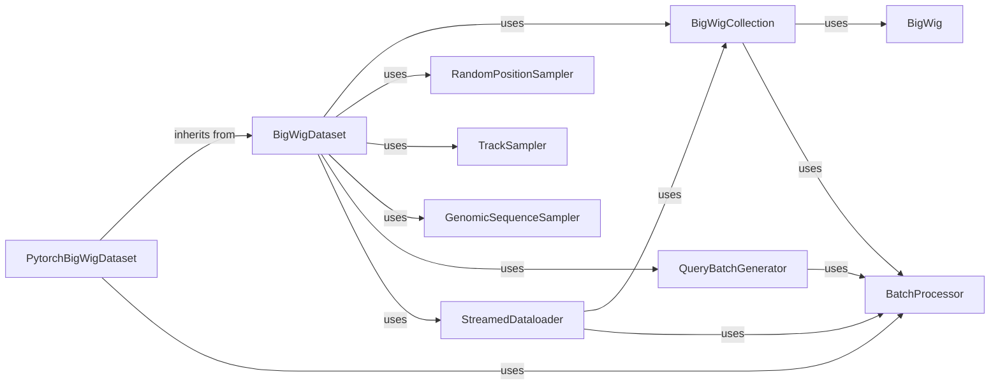

## Details

The `Dataset API & Framework Integration` subsystem is crucial for providing a user-friendly and performant interface to genomic data. It acts as the bridge between raw genomic files and deep learning models, abstracting away the complexities of data loading and preparation.

### BigWigDataset

This is the core, high-level, and framework-agnostic API for consuming genomic data from BigWig files. It orchestrates various sub-components like samplers and the collection manager to present a unified view of the genomic data. It's the primary entry point for users to define how genomic data is accessed and prepared.

**Related Classes/Methods**:

- `BigWigDataset` (1:1)

### PytorchBigWigDataset

This component extends `BigWigDataset` to provide seamless integration with PyTorch's data loading ecosystem. It specifically handles the conversion of loaded genomic data into PyTorch tensor formats, making it directly compatible with PyTorch's `DataLoader` and other utilities.

**Related Classes/Methods**:

- `PytorchBigWigDataset` (1:1)

### BigWigCollection

This component manages a collection of BigWig files, providing a unified interface to access data across multiple genomic tracks. It handles indexing, retrieval, and initial processing of data from various BigWig sources.

**Related Classes/Methods**:

- `BigWigCollection` (1:1)

### StreamedDataloader

This component orchestrates the high-performance streaming of genomic data. It's designed to efficiently deliver data, likely employing multi-threading or asynchronous processing, to ensure a continuous and rapid supply of data to the GPU or CPU.

**Related Classes/Methods**:

- `StreamedDataloader` (1:1)

### RandomPositionSampler

Provides strategies for sampling genomic data by selecting specific genomic positions.

**Related Classes/Methods**:

- `RandomPositionSampler` (1:1)

### TrackSampler

Provides strategies for sampling genomic data by selecting specific tracks.

**Related Classes/Methods**:

- <a href="https://github.com/pfizer-opensource/bigwig-loader/blob/main/bigwig_loader/sampler/track_sampler.py#L4-L11" target="_blank" rel="noopener noreferrer">`TrackSampler` (4:11)</a>

### GenomicSequenceSampler

Provides strategies for sampling genomic data by selecting specific genomic sequences.

**Related Classes/Methods**:

- `GenomicSequenceSampler` (1:1)

### QueryBatchGenerator

This component is responsible for generating and preparing batches of queries or requests for genomic data. It optimizes the structure of these requests to ensure efficient retrieval by the downstream data loading pipeline.

**Related Classes/Methods**:

- `QueryBatchGenerator` (1:1)

### BatchProcessor

This component likely handles the actual processing of batches, potentially including transformations or pre-processing steps before data is passed to the deep learning framework.

**Related Classes/Methods**:

- <a href="https://github.com/pfizer-opensource/bigwig-loader/blob/main/bigwig_loader/batch_processor.py#L29-L146" target="_blank" rel="noopener noreferrer">`BatchProcessor` (29:146)</a>

### BigWig

This component likely represents the low-level interface for reading and parsing individual BigWig files, handling the file format specifics.

**Related Classes/Methods**:

- `BigWig` (1:1)

### [FAQ](https://github.com/CodeBoarding/GeneratedOnBoardings/tree/main?tab=readme-ov-file#faq)