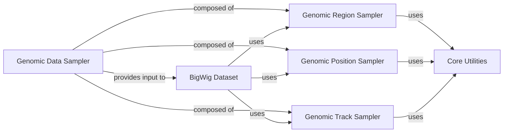

## Details

This subsystem is crucial for defining the "what" and "where" of genomic data to be loaded, acting as the primary interface for specifying regions of interest and data sources for the downstream data loading pipeline. Its modular design, leveraging the Strategy Pattern, allows for flexible and extensible sampling strategies.

### Genomic Data Sampler [[Expand]](./Genomic_Data_Sampler.md)

This is the overarching component responsible for orchestrating the generation of genomic positions or intervals, the selection of relevant BigWig files (tracks), and the sampling of genomic sequences. It defines the "regions of interest" and "data sources" for subsequent data extraction and batching, forming the foundational input for the high-performance data loading pipeline. It acts as the control plane for data selection, ensuring the `BigWig Dataset` receives the necessary context to load the correct genomic data efficiently.

**Related Classes/Methods**:

- <a href="https://github.com/pfizer-opensource/bigwig-loader/blob/main/bigwig_loader/sampler/__init__.py" target="_blank" rel="noopener noreferrer">`bigwig_loader/sampler/__init__.py`</a>

- <a href="https://github.com/pfizer-opensource/bigwig-loader/blob/main/bigwig_loader/sampler/genome_sampler.py" target="_blank" rel="noopener noreferrer">`bigwig_loader/sampler/genome_sampler.py`</a>

- <a href="https://github.com/pfizer-opensource/bigwig-loader/blob/main/bigwig_loader/sampler/position_sampler.py" target="_blank" rel="noopener noreferrer">`bigwig_loader/sampler/position_sampler.py`</a>

- <a href="https://github.com/pfizer-opensource/bigwig-loader/blob/main/bigwig_loader/sampler/track_sampler.py" target="_blank" rel="noopener noreferrer">`bigwig_loader/sampler/track_sampler.py`</a>

### Genomic Region Sampler

This sub-component is responsible for generating and managing the overarching genomic regions (e.g., chromosomes, start, and end coordinates) that will be used for data extraction. It provides mechanisms for both single genomic sequence sampling (`GenomicSequenceSampler`) and batch-oriented genomic sequence sampling (`GenomicSequenceBatchSampler`), ensuring that data can be requested in a structured manner.

**Related Classes/Methods**:

- <a href="https://github.com/pfizer-opensource/bigwig-loader/blob/main/bigwig_loader/sampler/genome_sampler.py#L19-L50" target="_blank" rel="noopener noreferrer">`bigwig_loader.sampler.genome_sampler.GenomicSequenceSampler` (19:50)</a>

- <a href="https://github.com/pfizer-opensource/bigwig-loader/blob/main/bigwig_loader/sampler/genome_sampler.py#L53-L109" target="_blank" rel="noopener noreferrer">`bigwig_loader.sampler.genome_sampler.GenomicSequenceBatchSampler` (53:109)</a>

- <a href="https://github.com/pfizer-opensource/bigwig-loader/blob/main/bigwig_loader/sampler/genome_sampler.py" target="_blank" rel="noopener noreferrer">`bigwig_loader/sampler/genome_sampler.py`</a>

### Genomic Position Sampler

This sub-component focuses on the precise sampling of individual positions within the broader genomic regions defined by the `Genomic Region Sampler`. It often incorporates randomness to select specific data points, which is vital for training machine learning models that require diverse input examples and for tasks like point-wise prediction.

**Related Classes/Methods**:

- <a href="https://github.com/pfizer-opensource/bigwig-loader/blob/main/bigwig_loader/sampler/position_sampler.py#L14-L56" target="_blank" rel="noopener noreferrer">`bigwig_loader.sampler.position_sampler.RandomPositionSampler` (14:56)</a>

- <a href="https://github.com/pfizer-opensource/bigwig-loader/blob/main/bigwig_loader/sampler/position_sampler.py" target="_blank" rel="noopener noreferrer">`bigwig_loader/sampler/position_sampler.py`</a>

### Genomic Track Sampler

This sub-component manages the selection of specific BigWig files, often referred to as "tracks," from a larger collection. It allows the system to filter and choose which types of genomic data (e.g., different epigenetic marks, gene expression levels) are relevant for a particular sampling operation, enabling flexible data source management.

**Related Classes/Methods**:

- <a href="https://github.com/pfizer-opensource/bigwig-loader/blob/main/bigwig_loader/sampler/track_sampler.py#L4-L11" target="_blank" rel="noopener noreferrer">`bigwig_loader.sampler.track_sampler.TrackSampler` (4:11)</a>

- <a href="https://github.com/pfizer-opensource/bigwig-loader/blob/main/bigwig_loader/sampler/track_sampler.py" target="_blank" rel="noopener noreferrer">`bigwig_loader/sampler/track_sampler.py`</a>

### BigWig Dataset

This component handles the actual data access and loading based on the information (regions, positions, tracks) provided by the `Genomic Data Sampler` and its sub-components. It translates the sampled genomic coordinates and selected tracks into concrete data retrieval operations from BigWig files.

**Related Classes/Methods**:

- <a href="https://github.com/pfizer-opensource/bigwig-loader/blob/main/bigwig_loader/dataset.py#L28-L270" target="_blank" rel="noopener noreferrer">`bigwig_loader.dataset.BigWigDataset` (28:270)</a>

- <a href="https://github.com/pfizer-opensource/bigwig-loader/blob/main/bigwig_loader/dataset.py" target="_blank" rel="noopener noreferrer">`bigwig_loader/dataset.py`</a>

### Core Utilities

This component provides general helper functions and utilities used across the library, including common data structures, validation routines, and other foundational functionalities that support the sampling process.

**Related Classes/Methods**:

- <a href="https://github.com/pfizer-opensource/bigwig-loader/blob/main/bigwig_loader/util.py" target="_blank" rel="noopener noreferrer">`bigwig_loader/util.py`</a>

- `bigwig_loader/exceptions.py`

### [FAQ](https://github.com/CodeBoarding/GeneratedOnBoardings/tree/main?tab=readme-ov-file#faq)