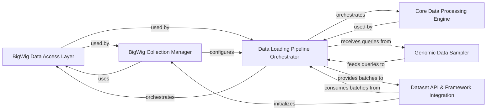

## Details

The bigwig-loader library is architected as a high-performance data loading pipeline for genomic deep learning, emphasizing GPU acceleration and modularity. The core design revolves around efficient data access, flexible sampling, and a streamlined processing pipeline that integrates seamlessly with deep learning frameworks.

### BigWig Data Access Layer

This component is responsible for the low-level parsing of individual BigWig file headers, managing internal file structures (e.g., BBI, Zoom, R-Tree indices), and providing efficient, direct access to raw compressed data blocks. It encapsulates the logic for reading and interpreting data from a single BigWig file.

**Related Classes/Methods**:

- <a href="https://github.com/pfizer-opensource/bigwig-loader/blob/main/bigwig_loader/bigwig.py#L1-L1" target="_blank" rel="noopener noreferrer">`bigwig_loader.bigwig` (1:1)</a>

- <a href="https://github.com/pfizer-opensource/bigwig-loader/blob/main/bigwig_loader/parser.py#L1-L1" target="_blank" rel="noopener noreferrer">`bigwig_loader.parser` (1:1)</a>

- <a href="https://github.com/pfizer-opensource/bigwig-loader/blob/main/bigwig_loader/store.py#L1-L1" target="_blank" rel="noopener noreferrer">`bigwig_loader.store` (1:1)</a>

### BigWig Collection Manager

Manages a collection of multiple BigWig files. It interprets file paths, maps them to specific values, and establishes a unified global coordinate system across all managed files. This component orchestrates the initialization and management of multiple BigWig Data Access Layer instances.

**Related Classes/Methods**:

- <a href="https://github.com/pfizer-opensource/bigwig-loader/blob/main/bigwig_loader/collection.py#L1-L1" target="_blank" rel="noopener noreferrer">`bigwig_loader.collection` (1:1)</a>

- <a href="https://github.com/pfizer-opensource/bigwig-loader/blob/main/bigwig_loader/path.py#L1-L1" target="_blank" rel="noopener noreferrer">`bigwig_loader.path` (1:1)</a>

### Genomic Data Sampler [[Expand]](./Genomic_Data_Sampler.md)

Generates random genomic positions or intervals (e.g., chromosomes, start, end), selects specific BigWig files (tracks) from the managed collection, and samples genomic sequences. It defines the regions of interest for data extraction, forming the basis for subsequent query batches.

**Related Classes/Methods**:

- <a href="https://github.com/pfizer-opensource/bigwig-loader/blob/main/bigwig_loader/sampler/position_sampler.py#L1-L1" target="_blank" rel="noopener noreferrer">`bigwig_loader.sampler.position_sampler` (1:1)</a>

- <a href="https://github.com/pfizer-opensource/bigwig-loader/blob/main/bigwig_loader/sampler/track_sampler.py#L1-L1" target="_blank" rel="noopener noreferrer">`bigwig_loader.sampler.track_sampler` (1:1)</a>

- <a href="https://github.com/pfizer-opensource/bigwig-loader/blob/main/bigwig_loader/sampler/genome_sampler.py#L1-L1" target="_blank" rel="noopener noreferrer">`bigwig_loader.sampler.genome_sampler` (1:1)</a>

### Core Data Processing Engine [[Expand]](./Core_Data_Processing_Engine.md)

Contains performance-critical, low-level functions for data manipulation and optimization. This includes efficient decompression of raw data blocks, memory management (especially for GPU-accelerated operations), optimized search algorithms (e.g., searchsorted for interval queries), transformation of interval-based genomic data into dense value arrays, and GPU-accelerated operations leveraging CuPy.

**Related Classes/Methods**:

- <a href="https://github.com/pfizer-opensource/bigwig-loader/blob/main/bigwig_loader/decompressor.py#L1-L1" target="_blank" rel="noopener noreferrer">`bigwig_loader.decompressor` (1:1)</a>

- <a href="https://github.com/pfizer-opensource/bigwig-loader/blob/main/bigwig_loader/memory_bank.py#L1-L1" target="_blank" rel="noopener noreferrer">`bigwig_loader.memory_bank` (1:1)</a>

- <a href="https://github.com/pfizer-opensource/bigwig-loader/blob/main/bigwig_loader/functional.py#L1-L1" target="_blank" rel="noopener noreferrer">`bigwig_loader.functional` (1:1)</a>

- <a href="https://github.com/pfizer-opensource/bigwig-loader/blob/main/bigwig_loader/searchsorted.py#L43-L83" target="_blank" rel="noopener noreferrer">`bigwig_loader.searchsorted` (43:83)</a>

- <a href="https://github.com/pfizer-opensource/bigwig-loader/blob/main/bigwig_loader/intervals_to_values.py#L22-L150" target="_blank" rel="noopener noreferrer">`bigwig_loader.intervals_to_values` (22:150)</a>

- <a href="https://github.com/pfizer-opensource/bigwig-loader/blob/main/bigwig_loader/cupy_functions.py#L1-L1" target="_blank" rel="noopener noreferrer">`bigwig_loader.cupy_functions` (1:1)</a>

### Data Loading Pipeline Orchestrator [[Expand]](./Data_Loading_Pipeline_Orchestrator.md)

The core orchestration engine for multi-process/multi-threaded data loading, processing, and batching. It takes sampled queries, retrieves raw data via the BigWig Data Access Layer (coordinated by BigWig Collection Manager), processes it using Core Data Processing Engine, and assembles standardized data batches. It manages worker contexts and streams processed batches for consumption.

**Related Classes/Methods**:

- <a href="https://github.com/pfizer-opensource/bigwig-loader/blob/main/bigwig_loader/input_generator.py#L1-L1" target="_blank" rel="noopener noreferrer">`bigwig_loader.input_generator` (1:1)</a>

- <a href="https://github.com/pfizer-opensource/bigwig-loader/blob/main/bigwig_loader/batch.py#L1-L1" target="_blank" rel="noopener noreferrer">`bigwig_loader.batch` (1:1)</a>

- <a href="https://github.com/pfizer-opensource/bigwig-loader/blob/main/bigwig_loader/batch_processor.py#L1-L1" target="_blank" rel="noopener noreferrer">`bigwig_loader.batch_processor` (1:1)</a>

- <a href="https://github.com/pfizer-opensource/bigwig-loader/blob/main/bigwig_loader/streamed_dataset.py#L1-L1" target="_blank" rel="noopener noreferrer">`bigwig_loader.streamed_dataset` (1:1)</a>

### Dataset API & Framework Integration [[Expand]](./Dataset_API_Framework_Integration.md)

Provides a high-level, framework-agnostic dataset interface for consuming genomic data. It integrates the Genomic Data Sampler, BigWig Collection Manager, and Data Loading Pipeline Orchestrator to present a unified view of the genomic data. This component also includes specific adapters for seamless integration with deep learning frameworks like PyTorch, converting data to appropriate tensor formats.

**Related Classes/Methods**:

- <a href="https://github.com/pfizer-opensource/bigwig-loader/blob/main/bigwig_loader/dataset.py#L1-L1" target="_blank" rel="noopener noreferrer">`bigwig_loader.dataset` (1:1)</a>

- <a href="https://github.com/pfizer-opensource/bigwig-loader/blob/main/bigwig_loader/pytorch.py#L1-L1" target="_blank" rel="noopener noreferrer">`bigwig_loader.pytorch` (1:1)</a>

### [FAQ](https://github.com/CodeBoarding/GeneratedOnBoardings/tree/main?tab=readme-ov-file#faq)